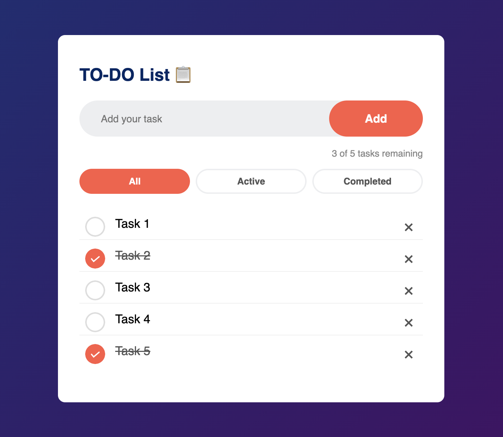

# TO-DO List App 📋

A simple To-Do List web app built while learning HTML, CSS, and JavaScript.

---

## 🖼️ Preview


---

## 🔗 Live Demo
👉 [Click here to view the app](https://jais001sushant-to-do-list.vercel.app)

---

## ✨ Features
- Add and delete tasks
- Mark tasks as completed
- Filter tasks — All / Active / Completed
- Task counter showing remaining tasks
- Data saved in localStorage (tasks survive page refresh)

---

## 🛠️ Built With
- HTML5
- CSS3
- JavaScript

---

## 📂 Project Structure
```
todo-app/
├── index.html
├── style.css
├── script.js
├── images/
│   ├── checked.png
│   └── unchecked.png
│   └── Screenshot.png
└── README.md
```

---

## 🚀 How to Run
1. Clone or download this repository
2. Open `index.html` in your browser
3. That's it — no setup or installation needed!